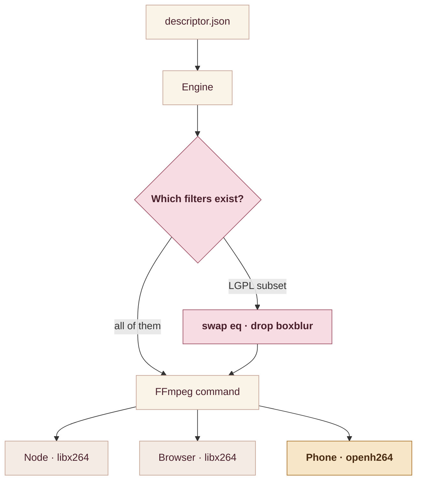

## The premise

Every browser-based video editor I've used does the same thing: you upload your footage, a server renders it, you download the result. It works. It also means your raw material sits on someone else's disk, and someone pays for a render farm.

So the question behind **[LeClap](https://leclap.dev)** was narrow and testable: **can the render happen where the footage already is?** Not "mostly", not "the preview at least" — the actual encode, on the actual device, with the same engine a server would use.

<div class="img-container">
  
</div>

The answer is yes — with an asterisk I'll get to. The cost is not the one I expected: I assumed the hard part would be performance. It wasn't. **The hard part is that "FFmpeg" is not one thing.** Ship it three ways and you get three different sets of filters and three different encoders, and a filter graph that works on your laptop can fail silently on a phone.

## The descriptor is the contract

Everything in LeClap starts from a JSON file that describes a video the way a score describes music: sections, transitions, text, music, effects, timing.

```json
{
  "global": { "fps": 30, "orientation": "landscape" },
  "sections": [
    { "name": "intro", "duration": 3, "text": { "content": "Shoot." } },
    { "name": "clip", "video": "@user", "transition": "fade" }
  ]
}
```

That descriptor is the only input. Everything downstream is derived from it: the *filter graph* — FFmpeg's word for the chain of effects each frame passes through — plus the segment list and the encoder settings. Which means the engine has exactly one job: **turn a declarative document into an FFmpeg command line.** Not into a rendered video. Into a *command* — one very long line of text that some other program will eventually run.

That distinction is what makes three runtimes tractable. If the engine produced pixels, every backend would need its own renderer. Because it produces a command, the backend only has to know how to *run* one.

## Three backends behind one interface

The engine defines an abstract adapter and three concrete implementations. An *adapter*, here, is just a translator: something that knows how to run a command in one specific place. The engine writes the instructions once; each adapter carries them out on its own turf.



Same package, three entry points (`src/index.ts`, `src/browser.ts`, `src/reactnative.ts`), one descriptor. The Node path is the reference: it's the fastest to iterate on and the easiest to debug, because you can copy the generated command into a terminal and watch it fail like a normal human.

The browser path was the one I expected to be hard, and it mostly wasn't — [ffmpeg.wasm](https://ffmpegwasm.netlify.app/) does the heavy lifting. You pay in bundle size and in the ceremony of a virtual filesystem, and you inherit a hard ceiling: the filesystem is IndexedDB-backed, so compilation caps out around **2 GB of input**. But conceptually it's the same engine executing the same arguments.

Mobile is where it got interesting.

## Embedding fftools in Rust

There's no "FFmpeg SDK". What people mean by *the FFmpeg command line* is `fftools/ffmpeg.c` and `fftools/ffprobe.c` — two C programs with a `main()`, sitting on top of libavcodec, libavfilter and friends.

You can't call `main()` from a library. So the build patches those two entry points into `ffmpeg_main()` and `ffprobe_main()`, statically links them alongside the LGPL FFmpeg libs, and wraps the result in a small Rust crate that exposes three functions:

```rust
extern "C" {
    fn leclap_ffmpeg_run(argc: c_int, argv: *const *mut c_char) -> c_int;
    fn leclap_ffprobe_run(argc: c_int, argv: *const *mut c_char) -> c_int;
    fn av_version_info() -> *const c_char;
    fn leclap_ffmpeg_cancel();
}
```

Three things came out of this that I hadn't planned for.

**fftools keeps its state in process globals.** `ffmpeg.c` was written to be a program, not a function — and a program gets the whole house to itself. It parks its settings, its progress, and its logging in shared variables, on the assumption that nothing else is around to touch them. Inside an app that assumption is wrong: start two renders at once and they scribble over each other's state. So the crate lets only one in at a time:

```rust
// fftools keep parsing/transcode state in process globals (ffmpeg.c) and write to the
// shared stdout/stderr fds, so only ONE invocation may run at a time.
static ENGINE_LOCK: Mutex<()> = Mutex::new(());
```

This is not a limitation you can engineer away without patching FFmpeg much more aggressively than I was willing to. It's also, in practice, fine: a compile pipeline issues its commands in sequence anyway. But it does mean "render two videos at once" is a product decision the architecture already made for you.

**Capturing output means redirecting file descriptors.** `ffprobe` writes JSON to stdout. In a library there is no stdout to read — so the crate redirects the fd, runs the call, reads the buffer, and restores it. Same for `ffmpeg`'s log, which goes to stderr and is the only thing that explains a failure. Getting that plumbing right is what turns "the render failed" into an actionable error message.

**Cancellation has to be explicit.** A user who backs out of a render expects it to stop, not to keep burning battery until it finishes. Hence `leclap_ffmpeg_cancel()`, and a fair amount of care about what state the engine is left in afterwards.

### Two languages, generated

The Rust core is useless to a React Native app on its own: Kotlin and Swift can't call it directly. Something has to translate.

That something is [uniffi](https://mozilla.github.io/uniffi-rs/), which generates the binding layer from the Rust itself. Annotate the types, and you get Kotlin and Swift APIs out of the build:

```rust
uniffi::setup_scaffolding!();

#[derive(uniffi::Record)]
pub struct RunResult {
    pub code: i32,
    pub log: String,
}
```

Written by hand, that's two foreign-function layers to get right and then keep in sync with every signature change, forever. Generated, it's a build step. **This is the single decision I'd defend most strongly** — not because Rust was necessary here (a C shim would also work), but because the generated bindings removed an entire category of drift between platforms.

The output is an `xcframework` for iOS — one bundle holding a build for real devices and another for the simulator — and three separate builds for Android, because Android phones don't all use the same kind of processor. Each one is a full compile of the entire FFmpeg stack from source. Five builds of a video codec library, to ship one app — which makes the build script comfortably the longest-running thing in the project.

## The licence wall

Here is the constraint that shapes everything downstream, and the one I see discussed least.

FFmpeg ships under two licences at once, and which one you get depends on how you build it. The default, LGPL, is the permissive one: link it into your app and ship. Many of its most useful parts are GPL instead — the stricter one, which reaches into whatever it is bundled with. You opt into them with `--enable-gpl`.

GPL's terms collide with Apple's App Store terms specifically — copyleft grants everyone the right to redistribute, the store forbids it — and that collision has pulled real apps off the store. It applies **even when your own code is open source.** LeClap is MIT, about as permissive as licences get, and it changes nothing: the obligation travels with FFmpeg, not with you.

So the on-device build is configured the other way:

```bash
--disable-gpl --enable-version3
```

That yields an LGPLv3 engine that can ship in a store app. It also removes filters. `eq` — brightness, contrast and saturation, so most of what anyone means by colour grading — is GPL. So is `boxblur`. If your look presets lean on them, they simply aren't there on the phone.

The pinned dependency list tells its own story about what "just build FFmpeg" involves:

```bash
FFMPEG_VERSION=n8.0
FREETYPE_VERSION=VER-2-13-3   # drawtext
HARFBUZZ_VERSION=8.5.0        # FFmpeg 8.0 drawtext hard-requires libharfbuzz
OPENH264_VERSION=2.5.0        # Cisco, LGPL-compatible H.264 encoder
LIBVPX_VERSION=1.14.1         # the only path that reads WebM (VP9) alpha overlays
```

That HarfBuzz line is the one that catches people out. FFmpeg 8.0 rewrote text shaping, and `drawtext` now refuses to build without it — so putting the word "Shoot." on a video pulls in a full text-shaping library, transitively, on three mobile architectures.

### And it takes the encoder with it

Dropping GPL doesn't only cost you filters. `libx264` is GPL, so the on-device build can't have it either — which means the thing that actually writes the bytes is different on every target:

| Target | Encoder | Driven by |
| --- | --- | --- |
| Node, browser | `libx264` | CRF, tune, profile |
| Android | `libopenh264` | bitrate |
| iOS | `h264_videotoolbox` (hardware) | bitrate |

CRF is a quality target; bitrate is a size target. They are not the same knob, so the same descriptor doesn't just produce different pixels across platforms — it produces them by a different *method*.

That's the asterisk from the opening. The render genuinely happens on the device, with the same engine and the same descriptor. What it does not produce is a byte-identical file to what a server would emit. Same composition, same cuts, same timings, same effects — reproducible run after run **on a given platform**, not across them.

## The consequence: the engine has to ask

Now put the pieces together. The Node build is GPL-capable. The WASM core is a different build again. The mobile engine is LGPL with a curated filter allowlist. **One descriptor, three sets of available filters.**

The naive outcome is the worst one: the graph is emitted, FFmpeg rejects an unknown filter, and the render fails — or worse, succeeds while quietly dropping the effect the user asked for. A silent difference between platforms is a bug you don't find in CI. You find it in a store review, six weeks later.

So the engine carries a capability model and consults it before emitting anything:

```ts
export type EngineCapabilities = {
  /** GPL filters available (eq, boxblur, …). False on the on-device LGPL engine. */
  gpl: boolean;
  lut3d: boolean;
  colorkey: boolean;
  /** drawtext text_shaping (HarfBuzz). Off by default — the WASM core may lack it. */
  textShaping: boolean;
  /** The curated on-device allowlist, or null on full builds. */
  deviceFilters: ReadonlySet<string> | null;
};
```

Compatibility rules then key off those flags rather than branching on the platform ad hoc. Each rule either **remaps** the filter to an available equivalent, or **drops it with a warning** — never silently:

```ts
{
  // The GPL `eq` filter is absent on the LGPL engine — rewrite it to an equivalent lutyuv LUT.
  key: 'eq-to-lutyuv',
  // …
}
```

The part I'm happiest with is smaller than the rules themselves: the device allowlist is **generated from the build script**, not maintained by hand.

```ts
// GENERATED from scripts/ffmpeg/common.sh — do not edit.
export const DEVICE_FILTERS: ReadonlySet<string> = new Set([ /* … */ ]);
```

A test asserts it stays in sync. Which means the failure mode "someone changed the FFmpeg build flags and the capability table now lies" is a red CI run instead of a broken render on a stranger's phone. Hand-maintained capability tables rot; this is the whole reason it's generated.

## What it actually bought

The honest summary, three runtimes in:

- **Footage never leaves the device.** Not as a privacy policy — as an architecture. There is no upload endpoint to audit because there is no upload.
- **No render infrastructure.** No farm, no object storage, no egress bill. The marginal cost of a render is someone else's battery, which is a trade users seem happy to make when the alternative is uploading a 200 MB take.
- **Offline, once assets are local.**

And the costs, stated plainly: the mobile build is the slowest part of CI by far; concurrent renders are off the table without patching FFmpeg's globals; the LGPL constraint permanently narrows both the filter palette and the encoder on the platform where users spend the most time; and every capability difference between backends is a thing you have to model rather than ignore.

If I were starting again I'd build the capability model *first*, before the second backend rather than after the third. Everything painful in this project traces back to discovering platform differences downstream of code that had already assumed they didn't exist.

---

The engine is on npm as `ffmpeg-video-composer`, with the CLI and an MCP server alongside it. All of it is MIT: [github.com/heristop/leclap](https://github.com/heristop/leclap).
